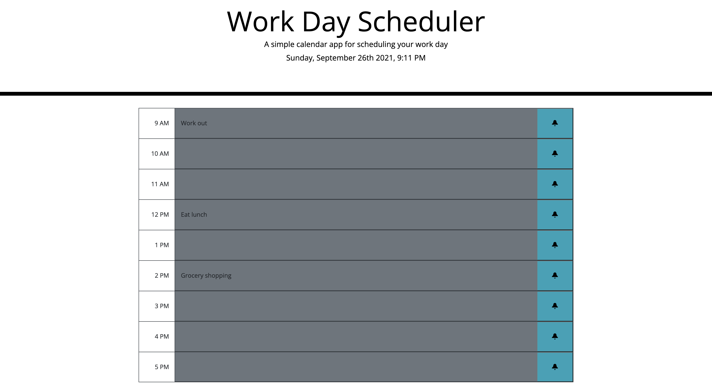

# Work Day Scheduler
## Introduction
The purpose for this website is to allow users to keep track of tasks they need to complete throughout their day, providing real-time color formatting to illustrate tasks that are late or tasks that are coming up.

## How It Was Made
This site was created utilizing the standard browser DOM Web API along with various third party APIs such as jQuery, Bootstrap, and Moment.js. jQuery allowed us to create more compact and understandable code for ease in future development and creation of the logic. Leveraging Bootstrap allowed the HTML elements to be more uniform in layout and style. Moment.js gave easier functionality for displaying date information and coordinating color formatting based on the current hour of the day. All these APIs combined made it easier to focus on the overall application's logic without getting bogged down in more complex code.

Link to published application: https://chaldrich24.github.io/day-scheduler/

